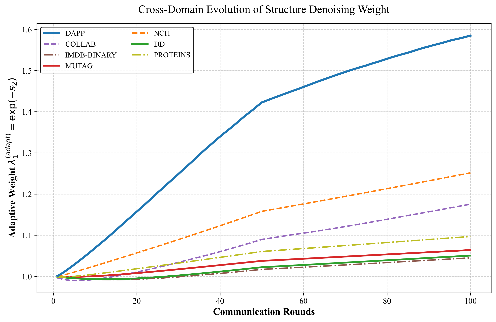

  <strong>Table 1: Performance Analysis of Adaptive Mechanism</strong>
    

  | Model | DAPP | COLLAB | IMDB-BINARY | DD | MUTAG | NCI1 | PROTEINS |
  | :---- | :--: | :----: | :---------: | :-: | :---: | :--: | :------: |
  | FedAvg | \(74.00 \pm 2.15\) | \(67.36 \pm 1.88\) | \(81.40 \pm 1.25\) | \(81.41 \pm 2.45\) | \(83.51 \pm 4.12\) | \(73.11 \pm 1.67\) | \(67.12 \pm 2.05\) |
  | FedAGHN | \(87.12 \pm 0.88\) | \(86.09 \pm 0.75\) | \(84.95 \pm 0.65\) | \(83.68 \pm 1.15\) | \(80.12 \pm 3.25\) | \(82.70 \pm 0.82\) | \(81.54 \pm 0.95\) |
  | <strong>Ours</strong> | <strong>\(95.79 \pm 0.43\)</strong> | <strong>\(87.86 \pm 0.33\)</strong> | <strong>\(92.43 \pm 0.54\)</strong> | <strong>\(82.56 \pm 0.88\)</strong> | <strong>\(86.25 \pm 0.47\)</strong> | <strong>\(92.75 \pm 0.53\)</strong> | <strong>\(90.27 \pm 0.65\)</strong> |

  
   
  <b>Figure 1: Performance Analysis of training rounds and hyperparameter dynamic adjustment curve</b>

